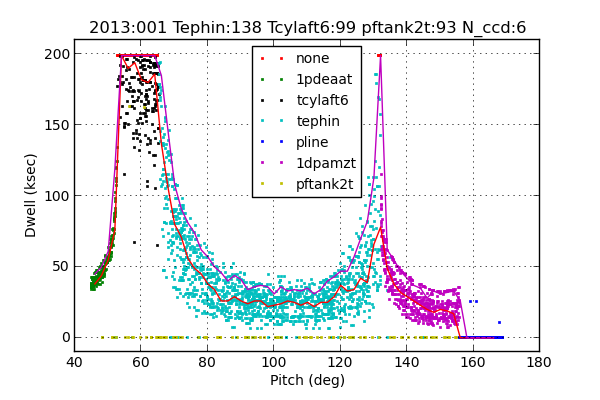
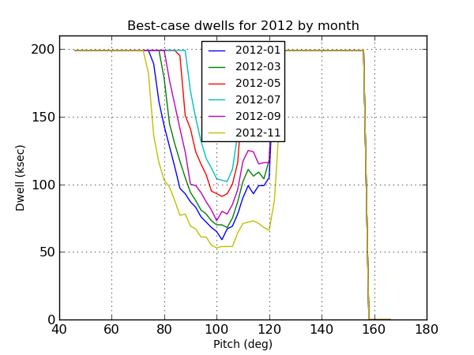

.. pyger documentation master file, created by
   sphinx-quickstart on Fri Oct  1 13:23:33 2010.
   You can adapt this file completely to your liking, but it should at least
   contain the root `toctree` directive.

=================================
Pyger
=================================

Pyger is a lightweight Python version of Liger for calculating allowed dwell times given spacecraft thermal constraints.

* Uses a Monte-Carlo approach to sample a realistic ensemble of perigee-exit starting temperatures.
* Generates both typically achievable (50%) and best-case (90%) dwell times.
* Includes PSMC, DPA, Minus-YZ, Fuel Tank, and PLINE models.
* Constraints implemented as Python classes derived from a base ConstraintModel class.

Pyger can be used in two complementary ways:

* `Command line usage`_:  generate a single constraint plot for given set of conditions
* `Python scripting`_: automate the generation of many plots

The sample output plot file below shows the Monte-Carlo sampling of different
starting conditions at each pitch.  The different dot colors represent the
limiting constraint.  The lower red line shows the median allowed dwell time
within each 2 degree pitch bin.  The upper magenta line shows the 90% value in
each bin and represents a reasonable "best case" at that pitch.

Command line usage
===================

Pyger is available from within the Ska runtime environment.  To initialize the environment enter::

  % source /proj/sot/ska/bin/ska_envs.csh

After this confirm that the `pyger` tool is available by asking for help::

  % pyger --help
  usage: pyger [-h] {make,sim} ...

  optional arguments:
    -h, --help  show this help message and exit

  Required sub-command (use exactly one):
    {make,sim}  Use "pyger <sub_command> --help" for help on sub-commands
      make      Make simulation inputs
      sim       Simulate constraints

This help message illustrates that the `pyger` command line tool has two distinct functionalities:

* Make the simulation inputs that are required for subsequent constraint simulations
* Run a constraint simulation

Make simulation inputs
------------------------

In order to generate realistic set of dwell times `pyger` requires a realistic
set of perigee-exit starting conditions that are appropriate to the time of the
simulation.  Since there is no longer a single "best-case" starting temperature
as there was for a 1-DOF TEPHIN model, `pyger` does this in the following fashion:

* Starting condition is a vector of temperatures (e.g. TEPHIN, TCYLAFT6, ...) or accumulated warm time
* Need an ensemble of starting conditions based on realistic observing profiles leading up to perigee exit
* Use actual profiles (about 120) from the last year:
   * For each profile start 3 days before perigee exit
   * Start with as-observed temperatures
   * Use thermal model at simulation time (future) to propagate all temps forward to perigee exit
   * This works for any thermal model including PSMC with variable CCD-count dependence

Actually generating the simulation inputs file is done with the command ``pyger
make``.  First look at the available options::

  % pyger make --help
  usage: pyger make [-h] [--sim-file SIM_FILE] [--start START] [--stop STOP]
                    [--n-days N_DAYS]

  optional arguments:
    -h, --help           show this help message and exit
    --sim-file SIM_FILE  Output file (default = sim_inputs.pkl)
    --start START        Sim input start time (default = Now - 1 year)
    --stop STOP          Sim input stop time (default = Now - 10 days)
    --n-days N_DAYS      Number of days to propagate prior to perigee exit
                         (default = 3)

Now run it, which takes about a minute using the recommended default settings::

  % pyger make
  Creating pyger simulation inputs covering 2012:130 to 2013:119
  Reading Obsids...
  Assembling inputs for pline
    Fetching aosares1 telemetry
  Assembling inputs for tank
    Fetching pftank2t telemetry
  Assembling inputs for minus_yz
    Fetching pmtank3t telemetry
    Fetching tmzp_my telemetry
    Fetching tephin telemetry
    Fetching tcylaft6 telemetry
  Assembling inputs for psmc
    Fetching 1pdeaat telemetry
  Assembling inputs for dpa
    Fetching 1dpamzt telemetry
  Assembling inputs for minus_z
    Fetching tcylaft6 telemetry
    Fetching tcylfmzm telemetry
    Fetching tephin telemetry
    Fetching tfssbkt1 telemetry
    Fetching tmzp_my telemetry
  Writing simulation inputs to sim_inputs.pkl

Note that the ``--start`` and ``--stop`` parameters can be specified in any valid  `DateTime format`_.

Run constraint simulation
-------------------------

The constraint simulation and plot generation is done with ``pyger sim``.  First look at the available options::

  % pyger sim --help
  usage: pyger sim [-h] [--start START] [--n-sim N_SIM] [--dt DT]
                   [--max-tephin MAX_TEPHIN] [--max-tcylaft6 MAX_TCYLAFT6]
                   [--max-1pdeaat MAX_1PDEAAT] [--max-1dpamzt MAX_1DPAMZT]
                   [--max-pftank2t MAX_PFTANK2T] [--n-ccd N_CCD]
                   [--max-dwell-ksec MAX_DWELL_KSEC] [--sim-file SIM_FILE]
                   [--plot-file PLOT_FILE] [--plot-title PLOT_TITLE]

  optional arguments:
    -h, --help            show this help message and exit
    --start START         Simulation start time
    --n-sim N_SIM         Number of simulation points
    --dt DT               Delta time for sims (sec)
    --max-tephin MAX_TEPHIN
                          TEPHIN planning limit (degF)
    --max-tcylaft6 MAX_TCYLAFT6
                          TCYLAFT6 planning limit (degF)
    --max-1pdeaat MAX_1PDEAAT
                          1PDEAAT planning limit (degC)
    --max-1dpamzt MAX_1DPAMZT
                          1DPAMZT planning limit (degC)
    --max-pftank2t MAX_PFTANK2T
                          PFTANK2T planning limit (degF)
    --n-ccd N_CCD         Number of ACIS CCDs
    --max-dwell-ksec MAX_DWELL_KSEC
                          Max allowed dwell time (ksec)
    --sim-file SIM_FILE   Simulation inputs pickle file
    --plot-file PLOT_FILE
                          Output plot file name
    --plot-title PLOT_TITLE
                          Title on output plot

Then run it, which takes about 25 seconds for the default settings::

  % pyger sim
  MINUS_YZ: calculating start temps for 117 dwells
  MINUS_YZ: simulating 500 dwells
  PSMC: calculating start temps for 117 dwells
  PSMC: simulating 500 dwells
  PLINE: calculating warm time for 117 dwells
  PLINE: simulating 500 dwells
  DPA: calculating start temps for 117 dwells
  DPA: simulating 500 dwells
  TANK: calculating start temps for 117 dwells
  TANK: simulating 500 dwells
  Writing constraint plot file constraints.png

Note that the ``--start`` parameter can be specified in any valid  `DateTime format`_.

Python scripting
================

The more powerful way to use ``pyger`` is via Python scripting and plotting.  This allows 
for the generation of complex plots in a reproducible way.  As for the command line interface
one requires an initial simulation inputs file.

The key function which is used to perform a constraint simulation is :func:`pyger.calc_constraints`.

.. autofunction:: pyger.calc_constraints
   :noindex:

This function has a lot of parameters but all of them have sensible defaults so
normally only a few need to be set.  Here is a sample script which is available on the
HEAD and GRETA networks as ``/proj/sot/ska/share/pyger/examples/plot_by_month.py``::

  """Plot best-case constraints for 2011 in 2-month intervals"""
  import matplotlib.pyplot as plt

  import pyger

  # Set up a few values that might be varied for different cases
  max_tephin = 147.0
  max_tcylaft6 = 102.0
  max_1pdeaat = 52.5
  max_1dpamzt = 32.5
  max_pftank2t = 93.0
  n_ccd = 5
  max_dwell_ksec = 200
  n_sim = 500   # Use 5000 for final plots but 500 for testing

  # Set up the font sizes and initialize figure
  plt.rc("axes", labelsize=10, titlesize=12)
  plt.rc("legend", fontsize=10)
  plt.figure(1, figsize=(6,4.5))
  plt.clf()

  # Step through 2012 in 2-month intervals
  for month in range(0, 12, 2):
      start = '2012-%02d-01T00:00:00' % (month+1)
      print '*** Calculating constraints for %s ***' % start
      constraints = pyger.calc_constraints(start=start,
                                           max_tephin=max_tephin,
                                           max_tcylaft6=max_tcylaft6,
                                           max_1pdeaat=max_1pdeaat,
                                           max_1dpamzt=max_1dpamzt,
                                           max_pftank2t=max_pftank2t,
                                           n_ccd=n_ccd,
                                           n_sim=n_sim,
                                           max_dwell_ksec=max_dwell_ksec)
      dwell1_stats = constraints['all'].dwell1_stats
      plt.plot(dwell1_stats['pitch'], dwell1_stats['dur90'] / 1000, label=start[:7])

  # Finish making the plot with labels and then save to a file
  plt.title('Best-case dwells for 2012 by month')
  plt.legend(loc='upper center')
  plt.xlabel('Pitch (deg)')
  plt.ylabel('Dwell (ksec)')
  plt.grid()
  plt.ylim(0, max_dwell_ksec * 1.05)
  plt.savefig('dwells_2012_month.png')

To run this script do the following::

  % cp /proj/sot/ska/share/pyger/examples/plot_by_month.py ./
  % ipython -pylab
  execfile("plot_by_month.py")

You should see the program churning away and finally a plot that looks like below.

The output of the :func:`pyger.calc_constraints` function needs a little
explanation.  As can be seen from the script this function returns a single
value which is a Python dict containing a key/value pair for each of the
constraint models.  Currently there are five constraint models named
``minus_yz``, ``psmc``, ``dpa``, ``tank``, and ``pline``.  The easiest way to
understand the output is to run the ``plot_by_month.py`` script as shown and
then start examining the ``constraints`` variable.
::

  >>> constraints
  {'all': <pyger.pyger.ConstraintModel at 0x1eba37d0>,
   'dpa': <pyger.pyger.ConstraintDPA at 0x1f533bd0>,
   'minus_yz': <pyger.pyger.ConstraintMinusYZ at 0x1f533f90>,
   'pline': <pyger.pyger.ConstraintPline at 0x20e7c810>,
   'psmc': <pyger.pyger.ConstraintPSMC at 0x1f533890>,
   'tank': <pyger.pyger.ConstraintTank at 0x20e7c0d0>}

So there are six elements in the dictionary, each of which is a
ConstraintModel object.  In addition to the five actual constraints
there is a special one called "``all``" which represents the 
merging of the three, i.e. taking the shortest allowed dwell time among
the three.  A ConstraintModel object has a number of attributes that can 
be discovered with::

  dir(constraints['pline'])
  dir(constraints['all'])

The most important are:

* ``dwells1``: dwell pitch, duration, and constraint name for each simulated dwell
* ``dwell1_stats``: binned statistics for the dwells

These are both NumPy record arrays (i.e. a table).  The available columns are::

  >>> print constraints['all'].dwells1.dtype.names
  ('pitch', 'dur', 'constraint_name')

  >>> print constraints['all'].dwell1_stats.dtype.names
  ('pitch_bin0', 'pitch_bin1', 'pitch', 'dur50', 'dur90')

The columns are accessed as follows, for example::

  dwells1 = constraints['all'].dwells1
  plot(dwells1['pitch'], dwells1['dur'], '.')

The code used by the ``pyger`` module to make a standard plot is illustrative
of useful techniques for scripting and plotting.  Note the filtering by constraint name::

  def plot_dwells1(constraint, plot_title=None, plot_file=None, figure=1):
      """Make a simple plot of the dwells and dwell statistics for the given ``constraint``.

      :param constraint: ConstraintModel object (e.g. constraints['all'])
      :param plot_title: plot title
      :param plot_file: output file for plot
      :param figure: matplotlib figure ID (default=1)
      """
      plt.rc("axes", labelsize=10, titlesize=12)
      plt.rc("xtick", labelsize=10)
      plt.rc("ytick", labelsize=10)
      plt.rc("font", size=10)
      plt.rc("legend", fontsize=10)

      dwells1 = constraint.dwells1
      dwell1_stats = constraint.dwell1_stats
      plt.figure(figure, figsize=(6,4))
      plt.clf()
      names = ('none', '1pdeaat', 'tcylaft6', 'tephin', 'pline',
               '1dpamzt', 'pftank2t')
      colors = ('r', 'g', 'k', 'c', 'b', 'm', 'y')
      for name, color in zip(names, colors):
          ok = dwells1['constraint_name'] == name
          plt.plot(dwells1['pitch'][ok], dwells1['dur'][ok] / 1000., '.' + color,
                   markersize=3, label=name, mec=color)
      plt.plot(dwell1_stats['pitch'], dwell1_stats['dur50'] / 1000., '-r')
      plt.plot(dwell1_stats['pitch'], dwell1_stats['dur90'] / 1000., '-m')
      plt.grid()
      plt.title(plot_title or '')
      plt.xlabel('Pitch (deg)')
      plt.ylabel('Dwell (ksec)')
      plt.legend(loc='upper center')
      plt.ylim(constraint.max_dwell_ksec * -0.05, constraint.max_dwell_ksec * 1.05)
      plt.subplots_adjust(bottom=0.12)
      if plot_file:
          logger.info('Writing constraint plot file {0}'.format(plot_file))
          plt.savefig(plot_file)

DateTime format
================

The available formats for ``start`` and ``stop`` times are listed in the table
below:

============ =============================================== =======
 Format      Description                                     System
============ =============================================== =======
  secs       Elapsed seconds since 1998-01-01T00:00:00       tt
  numday     DDDD:hh:mm:ss.ss... Elapsed days and time       utc
  jd*        Julian Day                                      utc
  mjd*       Modified Julian Day = JD - 2400000.5            utc
  date       YYYY:DDD:hh:mm:ss.ss..                          utc
  caldate    YYYYMonDD at hh:mm:ss.ss..                      utc
  fits       FITS date/time format YYYY-MM-DDThh:mm:ss.ss..  tt
  unix*      Unix time (since 1970.0)                        utc
  greta      YYYYDDD.hhmmss[sss]                             utc
============ =============================================== =======

Package API docs
=================
.. toctree::
   :maxdepth: 2

   pyger

Indices and tables
==================

* :ref:`genindex`
* :ref:`modindex`
* :ref:`search`

